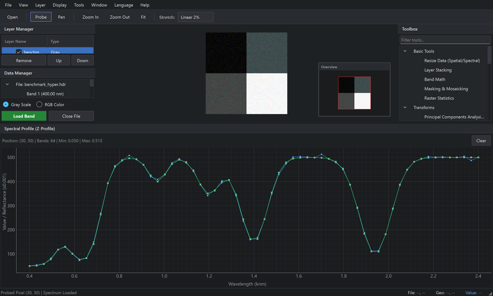
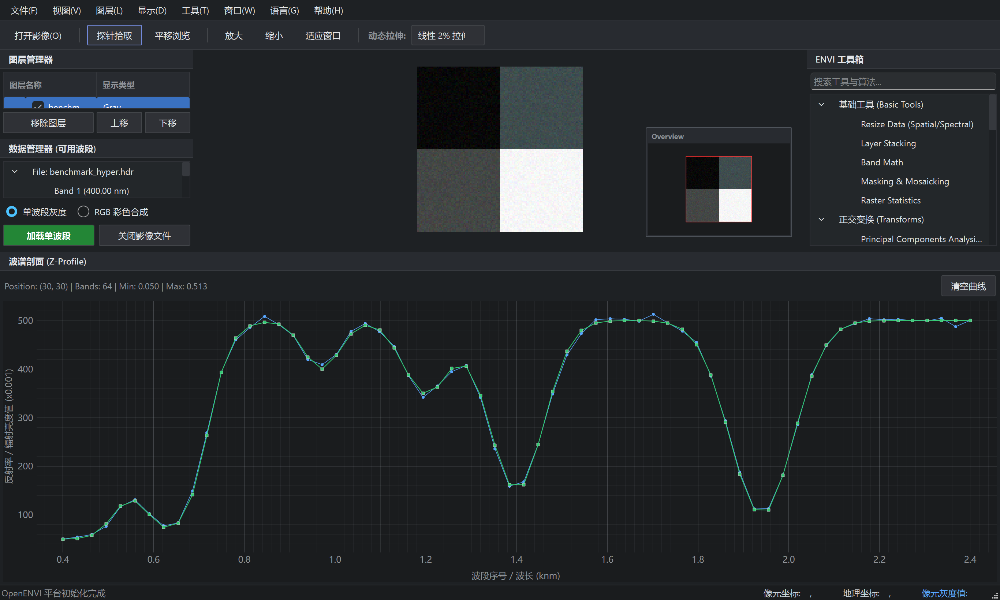

# OpenENVI: Lightweight Open-Source ENVI-Style Remote Sensing Platform

[](https://www.python.org/)
[](https://wiki.qt.io/Qt_for_Python)
[](https://www.pyqtgraph.org/)
[](LICENSE)
[](#7-running-tests)

*Read this document in [English](#english) | [中文说明](#chinese)*

---

<a name="english"></a>
## English

### 1. Project Overview & Philosophy
**OpenENVI** is a modern, lightweight, high-performance desktop remote sensing and hyperspectral image analysis platform. It is strictly modeled after the core interface organization, data management, and image processing workflows of **ENVI Classic / ENVI 5.x**.

- **Core Goal**: Faithfully replicate ENVI's professional workflows (Layout, Layer Manager, Main View, Data Manager, Spectral Profile, ROI, Contrast Stretch, Indices, Classification, Transforms) with a lightweight, modern, and uncluttered desktop experience.
- **Scope Boundary**: OpenENVI is focused exclusively on **Remote Sensing Raster Viewing + Hyperspectral Analysis + Essential Remote Sensing Workflows**. It is NOT a bulky GIS platform, AI chatbot shell, or web dashboard.

### 2. Workspace Layout
The application features a clean, high-density, professional dark-slate theme with fully dockable, resizable, and detachable panels via Qt `QDockWidget`:



```text
┌─────────────────────────────────────────────────────────────────────────────┐
│ OpenENVI   File   View   Layer   Display   Tools   Window   Language   Help │
├──────────────┬──────────────────────────────────────────────┬───────────────┤
│ [Toolbar] Open | Probe | Pan | Zoom In | Zoom Out | Fit | Stretch: Linear2% │
├──────────────┼──────────────────────────────────────────────┼───────────────┤
│              │                                              │ ENVI Toolbox  │
│ Layer        │                                              │ ├─Basic Tools │
│ Manager      │                  Main View                   │ ├─Transforms  │
│              │             (Pan/Zoom Viewport)              │ ├─Spectral    │
│              │                                              │ ├─Classify    │
├──────────────┤                     [Overview Eagle-Eye] ──┐ │ └─Indices     │
│              │                     └──────────────────────┘ │               │
│ Data Manager │                                              │               │
├──────────────┴──────────────────────────────────────────────┴───────────────┤
│                        Spectral Profile (Z-Profile)                         │
├─────────────────────────────────────────────────────────────────────────────┤
│ [Status Bar] File (X, Y) | Geo (Lat, Lon) | Value: [B1, B2, B3...] | Ready  │
└─────────────────────────────────────────────────────────────────────────────┘
```

- **Layer Manager (Top-Left Dock)**: Manages open image layers, visibility toggles, and display ordering.
- **Data Manager / Available Bands (Bottom-Left Dock)**: Replicates the signature ENVI Available Bands list with Gray Scale vs. RGB Color assignments.
- **Main View (Central Viewport)**: High-performance 2D/3D raster canvas powered by PyQtGraph with pan, zoom, coordinate mapping, and an integrated Eagle-Eye overview inset with draggable red ROI extent indicator.
- **ENVI Toolbox (Right Dock)**: Hierarchical tree categorizing Basic Tools, Transforms, Spectral Algorithms, Classification, and Indices.
- **Spectral Profile (Bottom Dock)**: Interactive Z-Profile plot displaying real-time spectral reflectance/DN curves across bands or calibrated wavelengths (nm/µm) with multi-point curve overlays.
- **Status Bar (Bottom)**: Displays cursor file coordinates `(X, Y)`, geographic coordinates `(Lat, Lon)`, and multi-band pixel values.

### 3. Architecture & Decoupling
OpenENVI follows a clean architecture where the UI layer and backend analytical routines communicate via a centralized Qt Signal/Event Bus (`core.events.AppEventBus`), ensuring zero tight coupling between UI widgets and computing pipelines:
- `pixel_hovered(int, int)`: Cursor hover location.
- `pixel_clicked(int, int)`: Cursor probe / selection location.
- `layer_changed(str)`: Layer selection and activation.
- `stretch_mode_changed(str)`: Dynamic contrast stretch selection.
- `profile_requested(int, int)`: Request Z-Profile calculation for given pixel.
- `language_changed(str)`: Dynamic language change event (`en` <-> `zh`).

### 4. Internationalization & Bilingual Support
OpenENVI provides seamless runtime language switching between **English** and **Simplified Chinese (简体中文)**:
- Switch dynamically anytime from the menu: `Language` -> `English` / `简体中文 (Chinese)`.
- All dock headers, menus, toolbar actions, status indicators, dialogs, and ENVI Toolbox categories update instantly without restarting the application.
- Full decoupling ensures algorithms and internal keys remain strictly standard English.

### 5. Implemented Features & Modules
- **I/O Engine**: Native ENVI `.hdr` parser & memory-mapped binary reader (`BSQ`, `BIL`, `BIP`) + GDAL/Rasterio GeoTIFF reader + In-Memory computed layer reader.
- **Display & Stretch Engine**: Min-Max, Linear 2%, Linear 5%, Histogram Equalization, Gaussian (StDev 3.0).
- **Region of Interest (ROI)**: Polygonal and rectangular ROI definition, multi-band statistics (Mean, StDev, Min, Max), and average spectral signature curve overlays.
- **Spectral Indices & Band Math**: Standard NDVI, NDWI, EVI, SAVI, NBR, plus an AST-based safe Band Math formula evaluator (supports `b1, b2...`, `np.sin`, `np.log`, etc.).
- **Hyperspectral Transforms**: Principal Component Analysis (PCA) and Minimum Noise Fraction (MNF) with automatic covariance and noise estimation.
- **Spectral Classification**: Spectral Angle Mapper (SAM) against library or target spectra, vectorized K-Means clustering, and iterative ISODATA classification with auto-generated thematic RGB palettes.
- **Synthetic Benchmark Generator**: Built-in 64-band hyperspectral cube generator modeling realistic vegetation, water, soil, and urban spectral signatures with Gaussian noise and spatial structures.

### 6. Installation & Setup
```bash
# Clone the repository
git clone https://github.com/Wukeeeeee/OpenENVI.git
cd OpenENVI

# Install dependencies
pip install -r requirements.txt

# Or install in editable mode
pip install -e .
```

### 7. Running the Application
```bash
# Run the desktop application
python -m app.main

# Or run via installed entry point
openenvi

# Test initialization without launching GUI loop
python -m app.main --test-init
```

### 8. Running Tests
Headless automated test execution using pytest and Qt offscreen platform:
```bash
pytest tests/ -v
```

---

<a name="chinese"></a>
## 中文说明

### 1. 项目概述与设计理念
**OpenENVI** 是一款现代化、轻量级、高颜值的开源桌面遥感与高光谱图像分析平台，严格对标 **ENVI Classic / ENVI 5.x** 的经典界面组织、数据管理流程与影像处理工作流。

- **核心目标**：忠实复刻 ENVI 专业工作流（包括布局结构、图层管理器、主视口、可用波段数据管理器、Z轴波谱曲线、感兴趣区 ROI、动态对比度拉伸、光谱指数、正交变换与遥感分类），打造轻量敏捷、现代极简且无冗余的科研级桌面分析体验。
- **范围边界**：OpenENVI 专注于**遥感栅格影像浏览 + 高光谱深入分析 + 必备遥感算法工作流**。不引入庞杂的综合 GIS 图层系统、AI 问答外壳或 Web 大屏。

### 2. 工作空间与界面布局
系统采用高信息密度、低视觉疲劳的专业深石板灰（Dark-Slate）主题，全界面面板基于 Qt `QDockWidget` 实现，支持停靠、自由缩放、拆分为独立浮动窗口：



- **图层管理器（左上方停靠面板）**：管理已加载影像图层、显隐切换、图层层叠顺序。
- **数据管理器 / 可用波段列表（左下方停靠面板）**：完整复刻经典 ENVI Available Bands 界面，支持单波段灰度（Gray Scale）与 RGB 彩色波段分配。
- **主视口（中央画布）**：基于 PyQtGraph 与 Qt 图元体系打造的超流畅 2D/3D 栅格显示视口，支持平移、缩放、像素精确定位及右下角集成式带可拖拽红色视野框的 Eagle-Eye 鹰眼缩略图。
- **ENVI 工具箱（右侧停靠面板）**：层次化树状工具库，涵盖基础工具、正交变换、光谱分析、遥感分类与波谱指数。
- **波谱剖面 / Z-Profile（底部停靠面板）**：交互式波谱曲线视口，实时显示所选像元在各波段（或对应标定波长 nm/µm）上的反射率/辐射亮度曲线，支持多点曲线叠加对比与清除。
- **状态栏（底部信息栏）**：实时输出像元文件坐标 `(X, Y)`、地理坐标 `(Lat, Lon)`、各波段像元 DN 值以及运行状态。

### 3. 解耦架构与全局信号总线
OpenENVI 贯彻高内聚低耦合的设计原则，前端 UI 视图与底层计算引擎完全通过 Qt 全局信号总线（`core.events.AppEventBus`）通信：
- `pixel_hovered(int, int)`：鼠标悬停坐标广播。
- `pixel_clicked(int, int)`：像元拾取与探针选点广播。
- `layer_changed(str)`：当前活动图层变更。
- `stretch_mode_changed(str)`：动态对比度拉伸模式切换。
- `profile_requested(int, int)`：触发指定像元波谱曲线计算。
- `language_changed(str)`：动态语言切换广播（`en` <-> `zh`）。

### 4. 国际化与中英双语支持
OpenENVI 内置无缝的中英文即时动态切换功能：
- 用户可在顶部菜单栏随时切换：`语言 (Language)` -> `English` / `简体中文`。
- 所有面板标题、菜单项、工具栏按钮、状态栏指示器、算法对话框及工具箱目录树均支持即时热切换，无需重启程序。
- 架构层面严格解耦，内部算法键与底层数据模型保持全英文规范。

### 5. 核心算法与功能模块
- **I/O 读取引擎**：原生 ENVI `.hdr` 解析器与内存映射高效二进制读取器（支持 `BSQ`、`BIL`、`BIP` 全存储排列）+ 基于 Rasterio 的 GeoTIFF 读写器 + 内存栅格图层引擎。
- **显示与对比度拉伸**：内置极值拉伸（Min-Max）、线性2%拉伸（Linear 2%）、线性5%拉伸（Linear 5%）、直方图均衡化（Equalization）与高斯拉伸（Gaussian 3.0σ）。
- **感兴趣区（ROI）工具**：多边形与矩形 ROI 交互绘制、多波段统计（均值、方差、极值）及 ROI 均值波谱曲线投影对比。
- **波谱指数与波段运算**：内置标准植被指数（NDVI）、水体指数（NDWI）、增强植被指数（EVI）、土壤调节指数（SAVI）与归一化燃烧比（NBR），集成基于抽象语法树（AST）的安全波段运算器（Band Math，支持 `b1, b2` 运算及数学函数）。
- **高光谱正交变换**：主成分分析（PCA）与最小噪声分离变换（MNF），支持自动协方差计算与噪声协方差估计。
- **光谱分类算法**：光谱角度制图（SAM）、全向量化 K-Means 聚类、迭代自组织数据分析（ISODATA），配备自动化高对比度假彩色类别图谱渲染。
- **合成高光谱基准测试生成器**：内置 64 波段合成遥感影像生成器，模拟植被、水体、土壤与城市建筑的标准波谱曲线与空间分布，方便零依赖开箱即测。

### 6. 安装与部署
```bash
# 克隆代码仓库
git clone https://github.com/Wukeeeeee/OpenENVI.git
cd OpenENVI

# 安装运行环境与依赖库
pip install -r requirements.txt

# 或以可编辑模式安装
pip install -e .
```

### 7. 运行应用
```bash
# 启动桌面主程序
python -m app.main

# 或通过已安装的命令行指令启动
openenvi

# 执行无头/静默启动检测（不进入主事件循环）
python -m app.main --test-init
```

### 8. 运行自动化测试
使用 pytest 在离屏（offscreen）模式下执行全套自动化测试：
```bash
pytest tests/ -v
```
